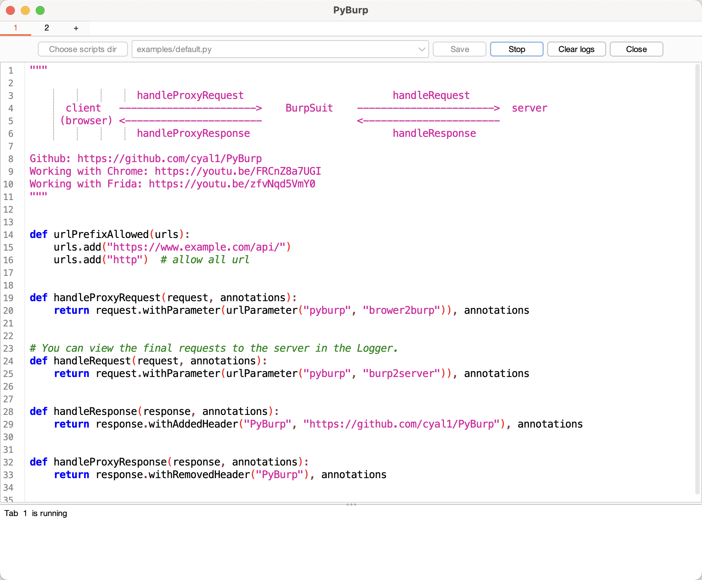

# PyBurp
[English Version](./README.md)

PyBurp 是一个强大的BurpSuite插件，它允许你编写简单的Python代码来动态修改HTTP请求和响应。特别适用于处理那些对HTTP请求响应加密的业务场景，因为它支持远程调用Chrome或移动应用中的加解密方法。

此外，PyBurp还支持:
* 复杂嵌套的JSON，Query String, XML之间的Content-Type转换
* 动态注册自定义上下文菜单
* 从HTTP history中保存需要的信息到sqlite数据库
* Chrome DevTools Protocol
* gRPC
* ...

**Video**

与Chrome交互： [https://youtu.be/FRCnZ8a7UGI](https://youtu.be/FRCnZ8a7UGI)    
与Frida交互： [https://youtu.be/zfvNqd5VmY0](https://youtu.be/zfvNqd5VmY0)

对于移动应用的方法调用，PyBurp本身不直接支持，而是依赖于Frida来实现远程交互。

> 请注意，以上功能仅在Burp Suite v2024.5.4上进行了全面测试。建议使用该版本或更新版本以确保最佳兼容性和稳定性。

## 安装
从[Release](https://github.com/cyal1/PyBurp/releases)页面下载或直接在BApp Store中安装。

如果要使用gRPC或调用移动应用程序中的方法，还需要安装 [pyburp](https://github.com/cyal1/PyBurpRpc/)
```bash
pip install pyburp
```


## 使用指南

### 预定义函数
PyBurp中预定义了一些函数，当你在脚本中定义这些函数时，会在自动在Burp Suite中注册对应的功能。详细函数如下表：

| function name                                                                                                                                                                                                                                                                                                                | Description                                                                                                                                     |
|------------------------------------------------------------------------------------------------------------------------------------------------------------------------------------------------------------------------------------------------------------------------------------------------------------------------------|-------------------------------------------------------------------------------------------------------------------------------------------------|
| handleRequest([request](https://portswigger.github.io/burp-extensions-montoya-api/javadoc/burp/api/montoya/http/message/requests/HttpRequest.html), [annotations](https://portswigger.github.io/burp-extensions-montoya-api/javadoc/burp/api/montoya/core/Annotations.html))                                                 | 处理Burp Suite和服务器之间的请求                                                                                                                           |
| handleResponse([response](https://portswigger.github.io/burp-extensions-montoya-api/javadoc/burp/api/montoya/http/message/responses/HttpResponse.html), [annotations](https://portswigger.github.io/burp-extensions-montoya-api/javadoc/burp/api/montoya/core/Annotations.html))                                             | 处理Burp Suite和服务器之间的响应                                                                                                                           |
| handleProxyRequest([request](https://portswigger.github.io/burp-extensions-montoya-api/javadoc/burp/api/montoya/http/message/requests/HttpRequest.html), [annotations](https://portswigger.github.io/burp-extensions-montoya-api/javadoc/burp/api/montoya/core/Annotations.html))                                            | 处理客户端和Burp Suite之间的请求                                                                                                                           |
| handleProxyResponse([response](https://portswigger.github.io/burp-extensions-montoya-api/javadoc/burp/api/montoya/http/message/responses/HttpResponse.html), [annotations](https://portswigger.github.io/burp-extensions-montoya-api/javadoc/burp/api/montoya/core/Annotations.html))                                        | 处理客户端和Burp Suite之间的响应                                                                                                                           |
| urlPrefixAllowed(urls)                                                                                                                                                                                                                                                                                                       | 设置当前PyBurp标签允许处理的url前缀，通过`urls.add(url)`添加，需要配合上面4个方法使用。不写这个函数那么所有请求会过上面4个被重写过的函数，你也可以在上面4个函数中定义自己的filter                                       |
| registerContextMenu(menus)                                                                                                                                                                                                                                                                                                   | 见[注册上下文菜单](#jump)                                                                                                                               |
| handleInteraction([interaction](https://portswigger.github.io/burp-extensions-montoya-api/javadoc/burp/api/montoya/collaborator/Interaction.html))                                                                                                                                                                           | 轮询Collaborator服务器。该方法会自动注册Collaborator客户端，可以通过`getOOBCanary()`获得Payloads，示例脚本: [collaborator.py](./src/main/resources/examples/collaborator.py) |
| passiveScan([baseRequestResponse](https://portswigger.github.io/burp-extensions-montoya-api/javadoc/burp/api/montoya/http/message/HttpRequestResponse.html))                                                                                                                                                                 | 被动扫描                                                                                                                                            |
| activeScan([baseRequestResponse](https://portswigger.github.io/burp-extensions-montoya-api/javadoc/burp/api/montoya/http/message/HttpRequestResponse.html), [auditInsertionPoint](https://portswigger.github.io/burp-extensions-montoya-api/javadoc/burp/api/montoya/scanner/audit/insertionpoint/AuditInsertionPoint.html)) | 主动扫描                                                                                                                                            |
| finish()                                                                                                                                                                                                                                                                                                                     | 停止脚本时会调用该函数                                                                                                                                     |

> 运行脚本后，可以在Burp Suite的Extensions选项卡中选中PyBurp插件，在Details中查看注册详情

### Examples
为了方便熟悉预定义函数的使用，PyBurp内置了一些常用的脚本，如下表：

| file name                                                                                    | Description                                                                                                    |
|----------------------------------------------------------------------------------------------|----------------------------------------------------------------------------------------------------------------|
| [api_documentation.py](./src/main/resources/examples/api_documentation.py)                   | 方便查看PyBurp的预定义函数和内置函数，**无需运行**                                                                                 |
| [notes.md](./src/main/resources/examples/notes.md)                                           | 记录一些Payloads（该文件不保存，请自己添加文件），**无需运行**                                                                          |
| [env_init.py](./src/main/resources/examples/env_init.py)                                     | 环境初始化，包含一些常用类和方法，每创建一个PyBurp标签页会自动执行该代码， **无需运行**                                                              |
| [bambdas.py](./src/main/resources/examples/bambdas.py)                                       | 快速从Proxy历史记录中提取信息,包含了查找超大响应的30x跳转，查找secretKey, web自定义字典生成三个示例                                                  |
| [chrome_devtools_protocol.py](./src/main/resources/examples/chrome_devtools_protocol.py)     | 远程调用Chrome DevTools中的方法                                                                                        |
| [collaborator.py](./src/main/resources/examples/collaborator.py)                             | Collaborator示例                                                                                                 |
| [customise_context_menu.py](./src/main/resources/examples/customise_context_menu.py)         | 注册上下文菜单，包含了NoSQL注入，条件竞争，权限绕过，unicode escape等多个示例                                                               |
| [default.py](./src/main/resources/examples/default.py)                                       | 默认脚本，简单演示了修改请求和响应                                                                                              |
| [encryptedCompleteBody.py](./src/main/resources/examples/encryptedCompleteBody.py)           | 处理整个HTTP Body加密示例                                                                                              |
| [encryptedCompleteBodyAes.py](./src/main/resources/examples/encryptedCompleteBodyAes.py)     | 处理整个HTTP Body AES加密示例                                                                                          |
| [encryptedJsonParam.py](./src/main/resources/examples/encryptedJsonParam.py)                 | 处理JSON参数加密示例                                                                                                   |
| [encryptedJsonParamRpc.py](./src/main/resources/examples/encryptedJsonParamRpc.py)           | 使用RPC处理加解密示例                                                                                                   |
| [encryptedQueryForm.py](./src/main/resources/examples/encryptedQueryForm.py)                 | 处理 Query String 加解密示例                                                                                          |
| [highlight_interesting_http.py](./src/main/resources/examples/highlight_interesting_http.py) | 高亮显示http请求和添加Notes示例，通常情况下更建议使用被动扫描                                                                            |
| [passive_active_scan.py](./src/main/resources/examples/passive_active_scan.py)               | 主动扫描和被动扫描示例                                                                                                    |
| [race_condition.py](./src/main/resources/examples/race_condition.py)                         | 条件竞争（HTTP2使用single-packet，HTTP1.1使用last-byte sync）                                                             |
| [rpc_debug.py](./src/main/resources/examples/rpc_debug.py)                                   | RPC测试                                                                                                          |
| [save_subdomain_to_sqlite.py](./src/main/resources/examples/save_subdomain_to_sqlite.py)     | 从Proxy HTTP history中收集子域名保存到数据库或文件                                                                             |
| [signatureHeader.py](./src/main/resources/examples/signatureHeader.py)                       | 处理header中的签名                                                                                                   |
| [urls_from_file.py](./src/main/resources/examples/urls_from_file.py)                         | 从文件中读取url并发送请求（Python多线程）                                                                                      |
| [urls_from_file2.py](./src/main/resources/examples/urls_from_file2.py)                       | 从文件中读取url并发送请求（[内置线程池](https://github.com/cyal1/PyBurp/blob/main/src/main/resources/examples/env_init.py#L46)） |
| [use_pip2_packages.py](./src/main/resources/examples/use_pip2_packages.py)                   | 使用python三方库示例，不是所有三方库都能在Jython中使用，尤其是用到了C库的                                                                    |

> 请注意，对内置examples脚本文件的修改不会被保存。
###  注册上下文菜单
<span id="jump"></span>
要在你的代码中注册上下文菜单项，首先需要定义一个名为 `registerContextMenu` 的函数，该函数接受一个菜单项集合menus作为参数。  
随后，通过调用 menus 对象的 `register` 方法来注册具体的菜单项。`register` 方法接收三个参数：菜单的名称，与菜单项相关联的函数名称（当菜单项被选中时调用的函数）和菜单类型(`MenuType`)，下表展示了`MenuType`5种类型和关联函数要求。

| MenuType         | function                                                                                                                                                                                                                                 |
|------------------|------------------------------------------------------------------------------------------------------------------------------------------------------------------------------------------------------------------------------------------|
| CARET            | 无需参数，返回一个字符串，当前光标处插入该字符串                                                                                                                                                                                                                 |
| SELECTED_TEXT    | 接受选中的字符串作为参数，返回处理后的字符串<br/>在可编辑的HTTP消息面板中会替换选中的字符串，反之弹窗显示返回的字符串                                                                                                                                                                          |
| REQUEST          | 接受一个[HttpRequest](https://portswigger.github.io/burp-extensions-montoya-api/javadoc/burp/api/montoya/http/message/requests/HttpRequest.html)类型参数，无返回值，在只需要http请求的情况下使用                                                                   |
| REQUEST_RESPONSE | 接受一个[HttpRequestResponse](https://portswigger.github.io/burp-extensions-montoya-api/javadoc/burp/api/montoya/http/message/HttpRequestResponse.html)类型参数，无返回值，在同时需要http请求和响应的情况下使用                                                        |
| MESSAGE_EDITOR   | 接受一个[MessageEditorHttpRequestResponse](https://portswigger.github.io/burp-extensions-montoya-api/javadoc/burp/api/montoya/ui/contextmenu/MessageEditorHttpRequestResponse.html)类型的参数，无返回值，在需要修改http消息面板内容时使用，通常情况下使用`SELECTED_TEXT`类型更方便 |

如下代码，演示了注册一个`purify headers`的上下文菜单，该菜单清除HTTP消息面板请求中多余的请求头。
```python
def removeBoringHeaders(editor):
    request = editor.requestResponse().request()
    editor.setRequest(request.withRemovedHeader("Sec-Ch-Ua")\
                             .withRemovedHeader("Sec-Ch-Ua-Mobile")\
                             .withRemovedHeader("Sec-Ch-Ua-Platform")\
                             .withRemovedHeader("Sec-Fetch-Site")\
                             .withRemovedHeader("Sec-Fetch-Mode")\
                             .withRemovedHeader("Sec-Fetch-Dest")\
                             .withRemovedHeader("Priority")
                             )

def registerContextMenu(menus):
    menus.register("purify headers", removeBoringHeaders, MenuType.MESSAGE_EDITOR)
```
当菜单类型为`MESSAGE_EDITOR`时，还有以下两个实用方法：
* getSelectedText([editor](https://portswigger.github.io/burp-extensions-montoya-api/javadoc/burp/api/montoya/ui/contextmenu/MessageEditorHttpRequestResponse.html)), 获取选中的文本，返回 [ByteArray](https://portswigger.github.io/burp-extensions-montoya-api/javadoc/burp/api/montoya/core/ByteArray.html) 对象
* replaceSelectedText([editor](https://portswigger.github.io/burp-extensions-montoya-api/javadoc/burp/api/montoya/ui/contextmenu/MessageEditorHttpRequestResponse.html), "new string")，替换选中的文本，返回[HttpRequest](https://portswigger.github.io/burp-extensions-montoya-api/javadoc/burp/api/montoya/http/message/requests/HttpRequest.html) 对象

更多示例请查看 [customise_context_menu.py](./src/main/resources/examples/customise_context_menu.py)。

###  RPC
PyBurp允许通过gRPC调用其它程序提供的方法。你需要实现 [burpextender.proto](https://github.com/cyal1/pyburpRPC/blob/main/burpextender.proto) 中定义的服务接口，以便进行这些调用。

对于使用Python用户，相关服务接口已经在 [pyburp](https://github.com/cyal1/pyburpRPC/) 中实现，你可以通过 `pip install pyburp` 安装并使用这个库。  
对于其他编程语言，请根据 [burpextender.proto](https://github.com/cyal1/pyburpRPC/blob/main/burpextender.proto) 文件生成代码并实现相应的服务接口。  

接下来以Python进行演示：

1. 运行RPC服务端，如下提供了`test1`, `test2`两个方法
   ```python
   import pyburp
   from base64 import b64encode
   
   def test1(s):
       return b64encode(s)
   
   def test2(i, j):
       return i + j
   
   pyburp.expose(test1)
   pyburp.expose(test2)
   pyburp.run("127.0.0.1:30051")
    ```

2. 在PyBurp中运行客户端代码,如下
    ```python
   server = rpc("localhost", 30051)
   result1 = server.callFunc('test1', bytearray("123"))
   result2 = server.callFunc('test2', 3, 4)
   print(result1)
   print(result1.tostring()) # or print(bytearray(result1))
   print(result2)
   server.shutdown()
    ```

和 Frida 交互示例请查看[server_frida.py](https://github.com/cyal1/pyburpRPC/blob/main/examples/server_frida.py)

**注意:**   
1. pyburp 只支持`str`,`bool`,`int`,`float`,`bytes`,`None`这几种类型的参数
2. 如果服务端暴露的方法**只有一个参数且为bytes类型**时，在PyBurp中需要通过[bytearray](https://portswigger.github.io/burp-extensions-montoya-api/javadoc/burp/api/montoya/core/ByteArray.html#byteArray(java.lang.String))封装参数，或者放入`[]`中，否则`byte[]`将被视为可变参数数组，每个字节被视为一个参数。
3. 服务端返回的`bytes`在PyBurp中为[array.array('b',initializer)](https://www.jython.org/jython-old-sites/docs/library/array.html#array-efficient-arrays-of-numeric-values)类型，你可以将其等同于`byte[]`，不同的是你需要使用`tostring()`将其转换成字符串而不是`toString()`。

## 贡献与反馈
欢迎社区成员对 PyBurp 提出改进建议、报告问题或贡献代码。

## 常见问题
1. 为什么有些python库或方法无法在PyBurp中使用？  
   PyBurp内置了Jython解释器而非标准的CPython，不是所有三方Python库都能使用，但能够无缝访问Java库。

2. 怎么在Jython中创建`byte[]`兼容的字节数组？   
   这里提供3个方法，请注意，将它转换成字符串时需要使用`tostring()`而不是`toString()`。   
   * [bytestring("asdf")](https://github.com/cyal1/PyBurp/blob/main/src/main/resources/examples/env_init.py#L122)
   * [bytearray("asdf").getBytes()](https://portswigger.github.io/burp-extensions-montoya-api/javadoc/burp/api/montoya/core/ByteArray.html)
   * `import array; print(array.array('b', [97, 115, 100, 102]))`
   
## 致谢
PyBurp 大部分灵感来自 [Turbo Intruder](https://github.com/PortSwigger/turbo-intruder/)


