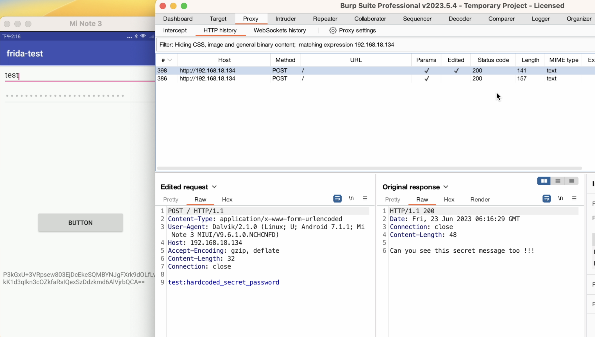
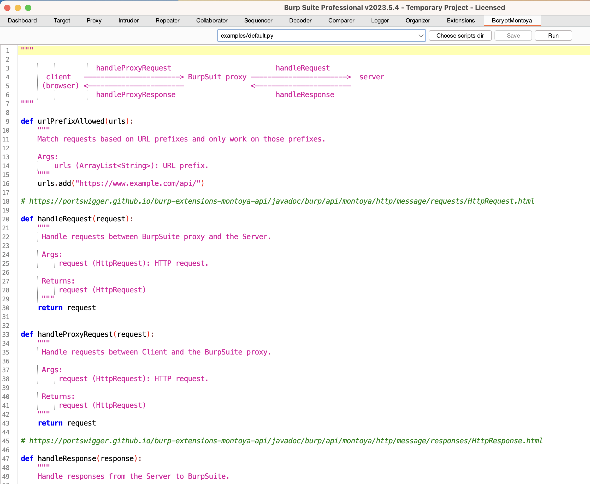
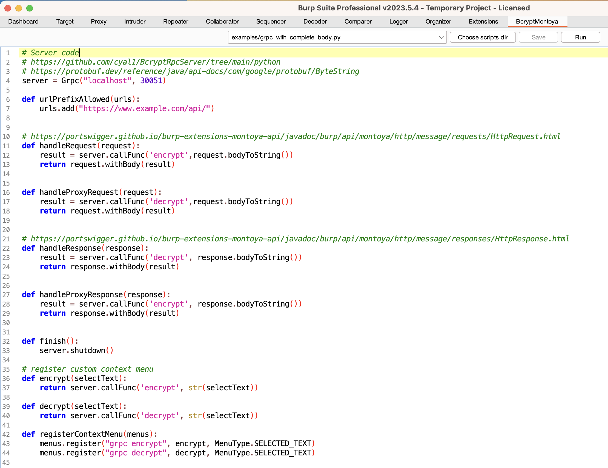
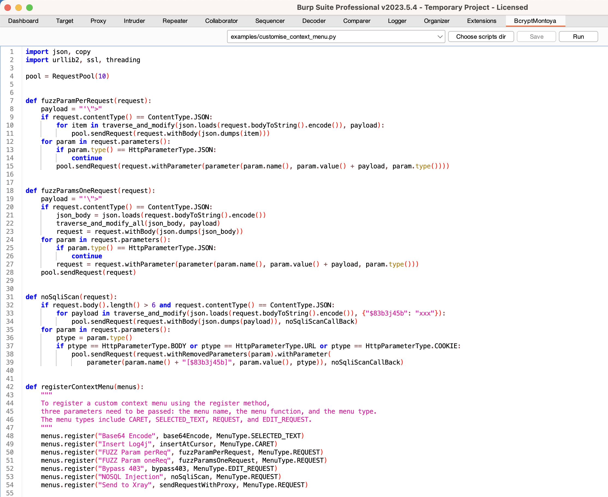
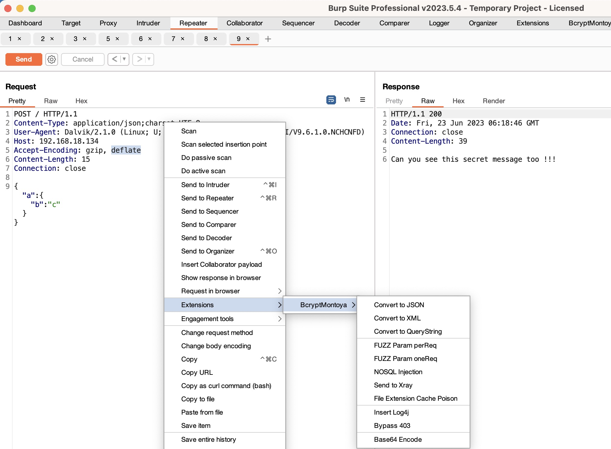

# BcryptMontoya

BcryptMontoya is a powerful plugin for Burp Suite that allows you to effortlessly modify HTTP requests and responses passing through the Burp Suite proxy using Jython code or gRPC, especially when dealing with encrypted requests.
In addition, BcryptMontoya provides the capability to register your own context menus, it provides some menus such as Content-Type conversions (supporting nested parameter conversions), NoSQL scanning, and forward selected requests to a specified proxy and so on.
BcryptMontoya draws inspiration from the popular [Turbo Intruder](https://github.com/PortSwigger/turbo-intruder/) tool and incorporates some of its code.

**Note: Developed using the New Burp Suite API - [Montoya](https://portswigger.net/blog/new-burp-suite-api-we-want-your-feedback), it is recommended to use BurpSuite v2023.5.4 or later.**

## Features
### You can watch the video [here](https://youtu.be/zfvNqd5VmY0).

## Snapshot

### Default

### gRpc

>   BcryptRpcServer: https://github.com/cyal1/BcryptRpcServer/

### ContextMenu

## Todo 
* Track state between requests.

## Contribution

Contributions are welcome! If you have any bug reports, feature requests, or suggestions, please create an issue.

